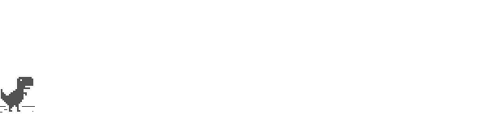

# T-Rex Runner

Recriação em **HTML, CSS e JavaScript** do jogo do dinossauro que aparece no Google Chrome quando não há conexão com a internet.

## Como jogar

- **Espaço** ou **seta para cima**: pular
- **Seta para baixo**: abaixar
- Desvie dos cactos e dos pterodáctilos; a velocidade aumenta com o tempo.

## Como executar

Basta abrir o arquivo `index.html` no navegador. Não há dependências nem etapa de build.

## Tecnologias

- HTML5 Canvas
- CSS
- JavaScript puro
